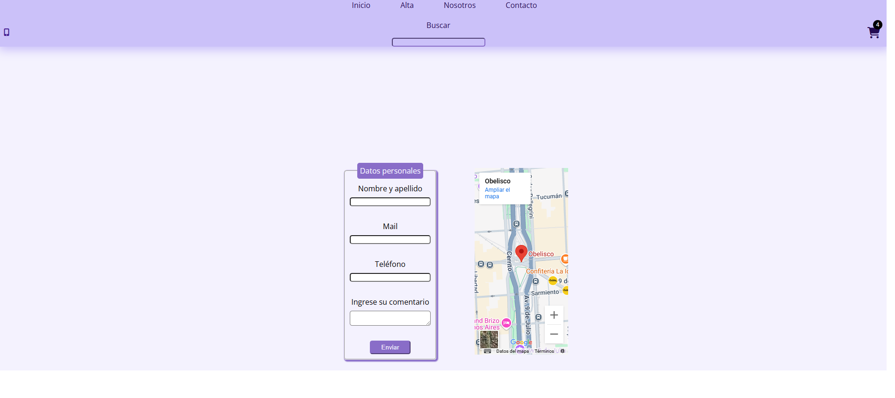

### Name: Sofía De Alessandre

### Link Github: https://github.com/SofiaDeAlessandre/integrador-etapa-2.git

### Link Netlify: https://sofia-de-alessandre-integrador-etapa2.netlify.app/

### Link MockApi (products): https://67ec5e9baa794fb3222da722.mockapi.io/api/v1/productos

### Link MockApi (cart): https://67ec5e9baa794fb3222da722.mockapi.io/api/v1/carrito

#### Description: "Boutique" is an e-commerce of electronics. This allows you to view all products in detail, filter them, add them to cart and add, edit and delete new products. This virtual store uses dinamic rutes, MockApi and responsive design.

#### Technologies: React, SaSS, MockApi

